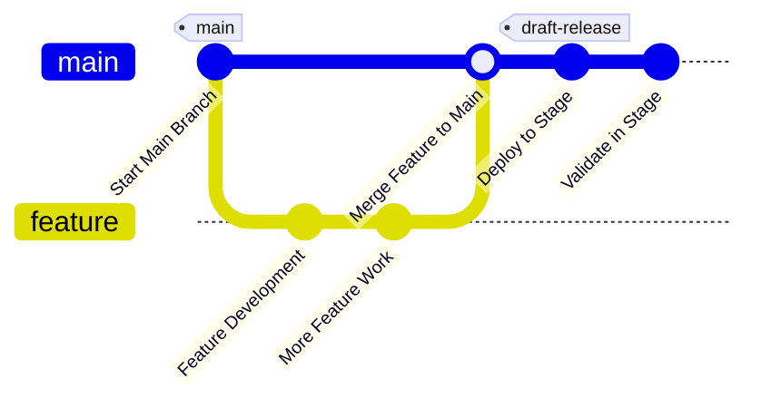
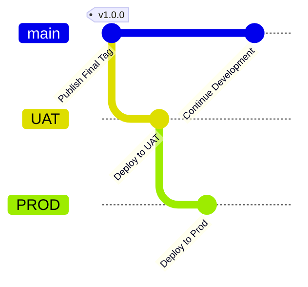

# mvn-java

package - build

### GitFlow Deployment Strategy Using Tags for a Maven Java Project

#### Overview
- **Feature Branch**: Developers create feature branches to work on specific features.
- **Development (Dev) Environment**: When a pull request (PR) is created from the feature branch to the `main` branch, it triggers a deployment to the Dev environment.
- **Stage Environment**: After validation and approval in Dev, the PR is merged into the `main` branch, triggering a deployment to the Stage environment and the creation of a draft release tag.
- **Final Release Tag**: Once the Stage environment is validated, the draft tag is published as the final release tag.
- **UAT/Production Deployment**: Publishing the tag triggers deployments to UAT and Production environments, each with an approval gate to control the deployment.

#### Workflow Steps
1. **Create Feature Branch**: Start by creating a feature branch for your new feature.
2. **Develop Feature**: Work on the feature in the feature branch.
3. **Create PR to Main**: Once the feature is ready, create a pull request to the `main` branch.
4. **Deploy to Dev**: The creation of the PR triggers a deployment to the Dev environment.
5. **Validate in Dev**: Validate the feature in the Dev environment. If everything looks good, and the required approvals are in place, proceed to merge the PR.
6. **Merge to Main**: After validation and approval, merge the feature branch into the `main` branch.
7. **Deploy to Stage**: Merging to the `main` branch triggers a deployment to the Stage environment and creates a draft release tag.
8. **Validate in Stage**: Validate the changes in the Stage environment. If approved, publish the draft tag.
9. **Publish Tag**: Publishing the tag creates the final release tag.
10. **Deploy to UAT/Prod**: The final release tag triggers deployments to the UAT and Production environments. An approval gate controls whether the deployment proceeds or is canceled.

#### Mermaid Chart

Update code
